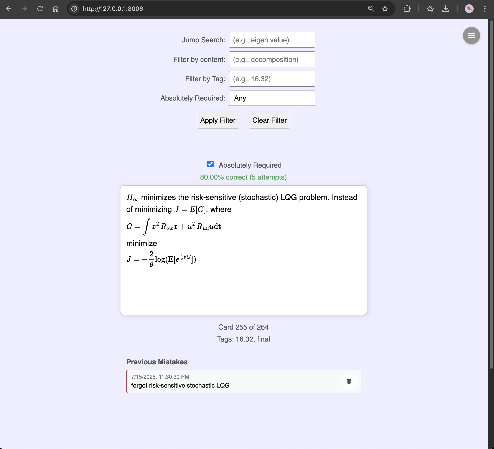
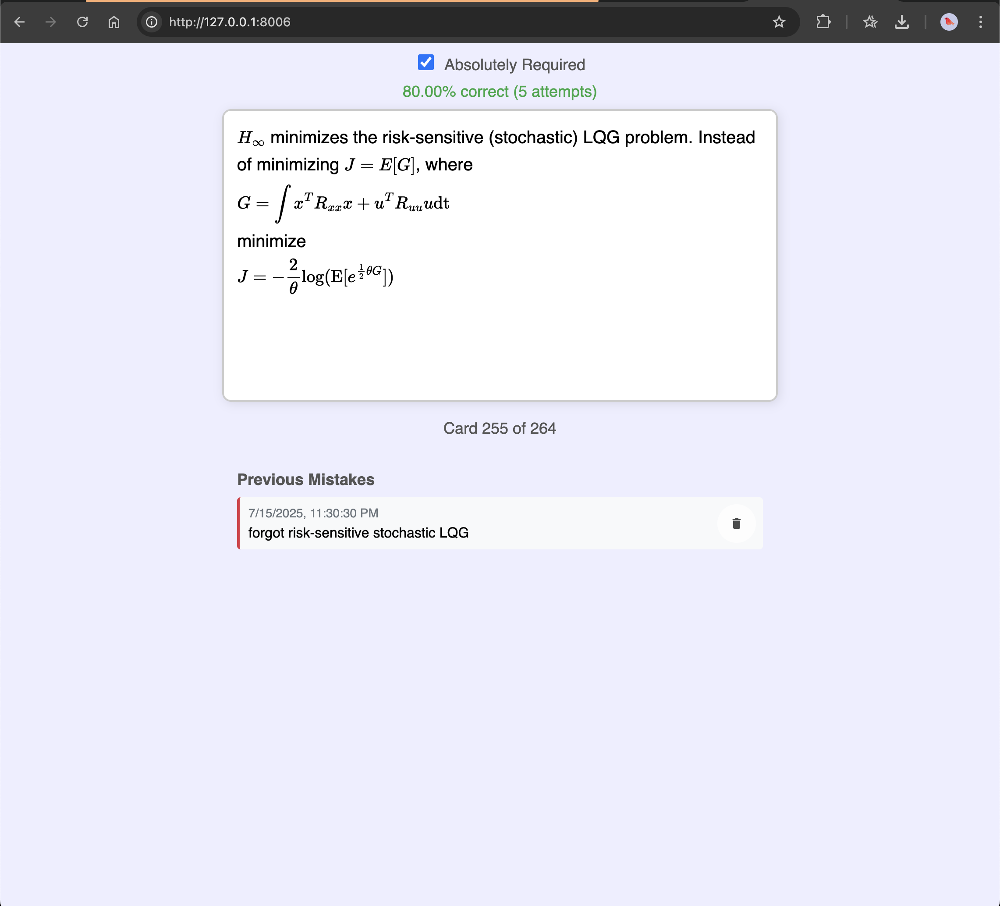
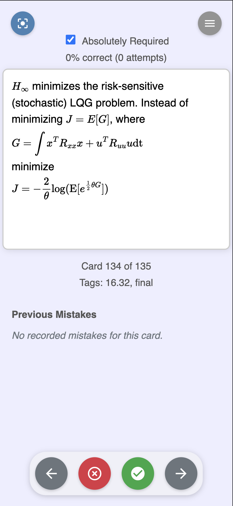

[](https://opensource.org/licenses/MIT) [](https://github.com/blakete/perdisco)  

# Perdisco Flashcard App

Perdisco is an open-source flashcard web application designed to help you master any material. It's been my secret weapon for acing countless exams. 🤫

**Etymology** (Latin verb): *perdisco* – to learn thoroughly, to master completely, to commit to heart.

---

## Screenshots

Here are some previews of the app in action on both desktop and mobile.

### Desktop Views


#### Focused Study Mode


### Mobile View (iPhone 14 Pro Max)


---

## Getting Started

Follow these instructions to set up and run the Perdisco flashcard web app locally. This assumes you have Python 3 installed on your system (version 3.8 or later recommended). The app is built with Flask and requires a virtual environment for dependency management.

### Prerequisites
- Python 3.
- Git (for cloning the repository).
- Basic command-line knowledge.

### Step 1: Clone the Repository
Open your terminal and clone the repo to your local machine using HTTPS (recommended for most users):

```
git clone https://github.com/blakete/perdisco.git
cd perdisco
```

Alternatively, if you have SSH keys set up with GitHub, use:

```
git clone git@github.com:blakete/perdisco.git
cd perdisco
```

### Step 2: Set Up a Virtual Environment
Create a virtual environment to isolate dependencies:

```
python3 -m venv .venv
```

Activate the virtual environment:
- On macOS/Linux:
  ```
  source .venv/bin/activate
  ```
- On Windows:
  ```
  .venv\Scripts\activate
  ```

Your terminal prompt should now show `(.venv)` to indicate the environment is active.

### Step 3: Install Dependencies
Install the required packages (Flask and its dependencies) from the `requirements.txt` file:

```
pip install -r requirements.txt
```

**Note:** If you accidentally run `pip install requirements.txt` without the `-r` flag, you'll get an error like "Could not find a version that satisfies the requirement requirements.txt." Always include `-r` to install from the file.

### Step 4: Run the App
The app script (`flashcards.py`) and supporting files (like `flashcards.json`) are in the `src` directory. Navigate there and start the server:

```
cd src
python3 flashcards.py
```

You should see output like this:

```
 * Serving Flask app 'flashcards'
 * Debug mode: on
WARNING: This is a development server. Do not use it in a production deployment. Use a production WSGI server instead.
 * Running on all addresses (0.0.0.0)
 * Running on http://127.0.0.1:8006
 * Running on http://YOUR_LOCAL_IP:8006
Press CTRL+C to quit
 * Restarting with stat
 * Debugger is active!
 * Debugger PIN: XXX-XXX-XXX
```

**Troubleshooting:**
- If you get a `FileNotFoundError` for `flashcards.json`, ensure you're running the script from the `src` directory (where the file is located). The app loads it relative to the script's path.
- The repo includes a `start.sh` script in the root directory. If you prefer, make it executable (`chmod +x start.sh`) and run it with `./start.sh`—it may automate some steps, but the manual method above works reliably.

### Step 5: Access the App
Open a web browser and go to `http://127.0.0.1:8006` (or the local IP shown in the terminal output). The flashcard app should now be running!

To stop the server, press `CTRL+C` in the terminal.

---

## Core Principles
1. **Active Recall**: Retrieving information strengthens memory more than passive review.
2. **Spaced Repetition**: Revisit material at increasing intervals to combat forgetting.
3. **Feynman Technique**: Explaining concepts in simple terms uncovers gaps in understanding.
4. **Dual Coding**: Combine verbal/written explanations with visuals or diagrams.
5. **Interleaving**: Mix topics to improve discrimination and flexibility.

## Why This Works
* **Feynman + Active Recall**: Forces retrieval and deep processing (Chi et al., 1994 show self-explanation boosts learning).
* **Spacing** + Interleaving: Matches cognitive load to memory decay (Dunlosky, 2013).
* **Dual Coding**: Visuals + verbalization engage multiple memory pathways (Paivio, 1971).

## Workflow
1. **Encode with Feynman + Flashcards**
    1. Before creating flashcards, try to explain the concept verbally or in writing as if teaching someone. Use analogies and mental images.
    2. Turn gaps from the Feynman attempt into question-driven flash cards.
        * For formulas: "Derive [formula] from [principle]."
        * For theorems: "Explain [theorem] in plain language and its implications."
    3. Iterate and enrich flashcards with visuals and diagrams where necessary.
2. **Active Recall & Spaced Repitition**
    * **Daily Reviews**: Prioritize cards you struggled with during Feynman attempts.
    * **Interleave Topic**: Shuffle cards within and across subjects.
    * **Graduated Intervals**: Use algorithm to space reviews (e.g., 1 day → 3 days → 1 week).
3. **Deepen Understanding with Feynman Checkpoints**
    * Tailor the ratio of flashcards to Feynman checkpoint sessions based on topic complexity (e.g., spend more time teaching proofs than formulas).
    * Weekly Teach-Aloud Sessions:
        * Pick 2–3 important concepts from recent flashcards.
        * Explain them aloud without notes, then refine using the 3-step Feynman method:
            * Teach: Verbalize the concept simply.
            * Identify Gaps: Note where you falter or overcomplicate.
            * Relearn & Simplify: Return to sources, fill gaps, and re-explain.
    * Written Summaries: After mastering a topic, write a 1-paragraph "explainer" using analogies.
4. **Metacognition & Error Analysis**
    * Mistake Log: Track recurring errors (e.g., "Confused Theorem A with Theorem B").
    * Targeted SRS Tags: Flag error-prone cards in Anki for extra reviews.
    * Self-Testing: Every 2 weeks, solve novel problems (e.g., proofs, derivations) under timed conditions.
